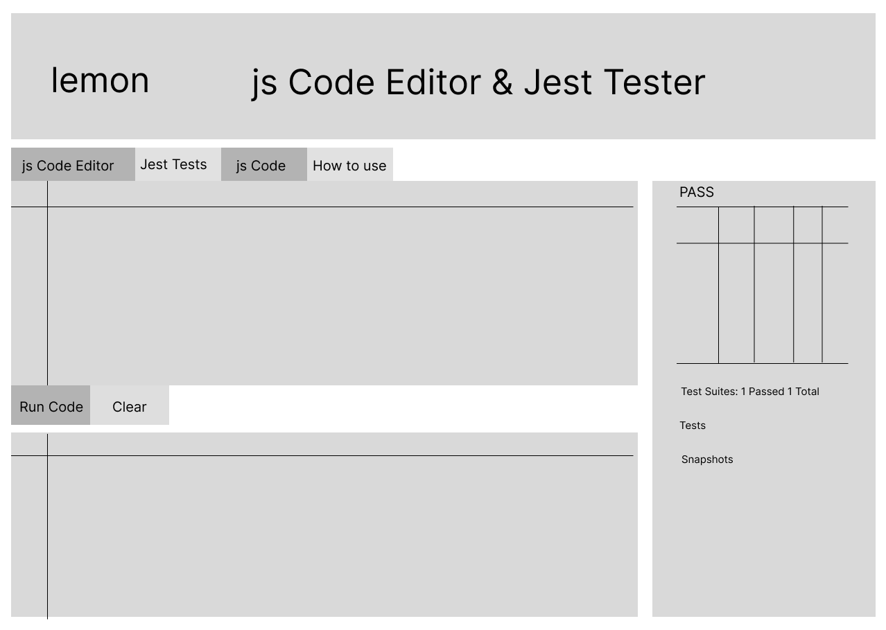

#  Lemon

## Purpose and Name Origin

Lemons are often associated with something sour or problematic, much like bugs or errors in code. However, challenging this stereotype, "Lemon" strives to introduce simplicity and freshness into JavaScript testing. "Lemon" is a web application built with Next.js, featuring a code editor and a console. It allows users to input JavaScript code directly or upload files to be tested using Jest. "Lemon" utilizes isolated-vm to prevent malicious code from being executed. The console displays the results of the executed code or tests, along with the test coverage when a test file is uploaded. "Lemon" provides a convenient platform for testing JavaScript code snippets and files using Jest within a Next.js environment.

## Technologies Used


## Features

### Basic

- **Code Editor:** Input, edit and run JavaScript code directly in the browser. Save to your computer.
- **File Upload:** Upload test files to run Jest tests against the provided code.
- **Validation and Sanitization:** Ensures that only safe and valid JavaScript code can be executed.
- **Console Output:** Displays the results of executed code or test outcomes.
- **Test Coverage:** Shows the test coverage metrics.

### Advanced

- **Themes:** Add themes like dark mode. [PLANNED]
- **Linting:** Automatic linting. [PLANNED]
- **Code formatting:** Integrate code formatter. [PLANNED]
- **React Testing:** Tests React snippets. [PLANNED]
- **Enhanced Code Editor:** Add syntax highlighting and autocompletion. [PLANNED]
- **Keyboard Shortcuts:** Integrate keyboard shortcuts for a more seamless coding experience. [PLANNED]
- **Performance:** Implement tools to monitor the performance of code execution, helping users optimize their code. Provide detailed logs and reports on execution times and memory usage. [PLANNED]
- **Documentation/Tutorials:** Create comprehensive documentation and interactive tutorials to help users get started. [PLANNED]

## Project Wireframe

- Figma created wireframe.



This is a [Next.js](https://nextjs.org/) project bootstrapped with [`create-next-app`](https://github.com/vercel/next.js/tree/canary/packages/create-next-app).

## Getting Started

First, run the development server:

```bash
npm run dev
# or
yarn dev
# or
pnpm dev
# or
bun dev
```

Open [http://localhost:3000](http://localhost:3000) with your browser to see the result.

You can start editing the page by modifying `app/page.tsx`. The page auto-updates as you edit the file.

This project uses [`next/font`](https://nextjs.org/docs/basic-features/font-optimization) to automatically optimize and load Inter, a custom Google Font.

## Learn More

To learn more about Next.js, take a look at the following resources:

- [Next.js Documentation](https://nextjs.org/docs) - learn about Next.js features and API.
- [Learn Next.js](https://nextjs.org/learn) - an interactive Next.js tutorial.

You can check out [the Next.js GitHub repository](https://github.com/vercel/next.js/) - your feedback and contributions are welcome!

## Deploy on Vercel

The easiest way to deploy your Next.js app is to use the [Vercel Platform](https://vercel.com/new?utm_medium=default-template&filter=next.js&utm_source=create-next-app&utm_campaign=create-next-app-readme) from the creators of Next.js.

Check out our [Next.js deployment documentation](https://nextjs.org/docs/deployment) for more details.
